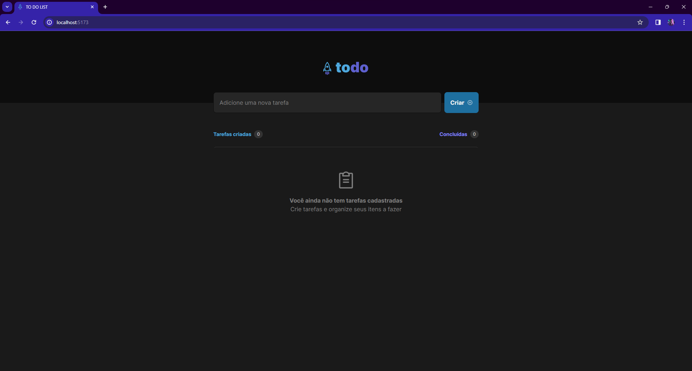
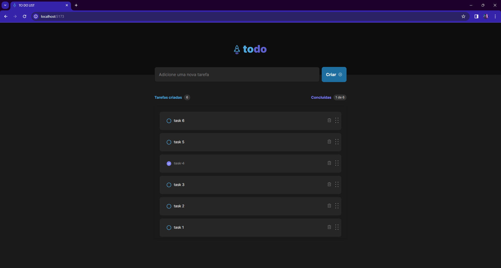

# TO DO list

## Overview

This project is part of the Ignite track offered by Rocketseat, designed to improve skills in the React library. The TO DO LIST is a simple task management application built with React. It allows users to add, delete, and mark tasks as completed. The user interface is designed for an efficient and user-friendly experience.




## Features

- **Add Task:** Users can add a new task by entering the task content in the input field and clicking the Create button or enter key.

- **Delete Task:** Tasks can be deleted individually by clicking the delete button associated with each task.

- **Mark as Completed:** Users can mark tasks as completed by checking the checkbox next to the task.

- **Task Statistics:** The application displays the number of tasks created and the number of tasks marked as completed.

- **Task Reordering:** Tasks can be reordered using drag-and-drop functionality, providing a customizable organization of tasks.

## Technologies Used

- React
- Phosphor Icons
- Material-UI
- Framer Motion
- TypeScript
- Tailwind

## Getting Started

To run this project locally, follow these steps:

1. Clone the repository:

```bash
git clone https://github.com/navestelar/todolist
```

2. Navigate to the project directory:

```bash
cd todolist
```

3. Install dependencies:

```bash
npm install
```
or
```bash
npm i
```

4. Start the development server:

```bash
npm run dev
```

The application will be accessible at [http://localhost:5173](http://localhost:5173).

## Project Structure

The project structure is organized as follows:

- `src/`: Contains the source code of the React application.
  - `assets/`: Includes image assets used in the project.
  - `components/`: Holds React components, such as `Task`, `Empty` and custom UI components.
  - `ui/`: Contains additional UI components, like `ScrollWrapper`.
- `App.tsx`: The main component that orchestrates the application's functionality.

## License

This project is licensed under the MIT License - see the [LICENSE](LICENSE) file for details.

## Acknowledgments

- This project was created as part of the Ignite track by Rocketseat.
  
Feel free to explore, contribute, and customize the TO DO LIST to suit your needs. Happy coding!